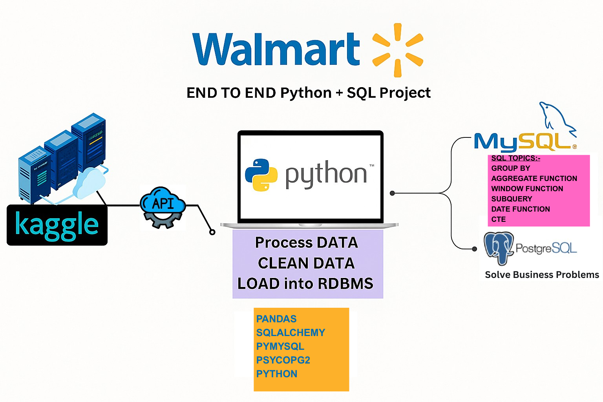

# Walmart Sales Analysis: End-to-End SQL + Python Project

## Project Overview




This project is an end-to-end data analysis solution designed to extract business insights from Walmart sales data using **Python** and **PostgreSQL (via pgAdmin4)**. It covers everything from data cleaning to complex SQL queries to solve real business problems.

---

## Project Steps

### 1. Environment Setup
- **Tools Used**: Jupyter Notebook, Python, PostgreSQL (pgAdmin4)
- **Python Libraries**: pandas, sqlalchemy, psycopg2, pymysql
- Install all required libraries using:
  ```bash
  pip install -r requirements.txt
  ```

### 2. Dataset Download
- **Data Source**: Use the Kaggle API to download the Walmart sales datasets from Kaggle.
- **Dataset Link**: [Walmart Sales Dataset](https://www.kaggle.com/najir0123/walmart-10k-sales-datasets)
- Configure Kaggle API and use the command:
  ```bash
  kaggle datasets download -d najir0123/walmart-10k-sales-datasets
  unzip walmart-10k-sales-datasets.zip
  ```

### 3. Dataset Overview
- **Raw Data**: `Walmart.csv`
- **Cleaned Data**: `walmart_clean_data.csv`
- **Source**: Imported locally and cleaned using Python

### 4. Data Cleaning & Feature Engineering
- Removed duplicates, handled nulls, and ensured consistent data types
- Created new calculated fields (e.g., total revenue)
- Saved cleaned data to `walmart_clean_data.csv`

### 5. Load to PostgreSQL
- Created table schema manually or via Python
- Loaded cleaned CSV using pgAdmin4 or the following SQL:
  ```sql
  COPY walmart FROM '/path/to/walmart_clean_data.csv' DELIMITER ',' CSV HEADER;
  ```

### 6. SQL Analysis using PostgreSQL
Key questions answered:
- Different payment methods and their usage
- Highest average rating category per branch
- Busiest day of the week per branch
- Items sold per payment method
- Cities with highest average transaction total
- Average, min, max ratings per category and city
- Product line with highest revenue
- Total profit per category (ranked)
- Most used payment method per branch
- Transactions by shift
- Branches with largest revenue drop from 2022 to 2023

Refer to:
- `Questions.pdf` for the business questions
- `Questions.sql`, `Answers.sql`, and `Q and A.sql` for SQL scripts

### 7. Notebook Analysis
- All data preprocessing and DB connections handled in `project.ipynb`
- Contains data inspection, transformations, and SQL queries via Python

---

## Folder Structure

```plaintext
|-- WalmartSales_Analysis.png        # Project visual workflow
|-- Questions.pdf                    # Business questions
|-- project.ipynb                    # Python workflow
|-- requirements.txt                 # Library requirements
|-- Walmart.csv                      # Raw dataset
|-- walmart_clean_data.csv           # Cleaned dataset
|-- Questions.sql                    # SQL questions
|-- Answers.sql                      # Final SQL solutions
|-- Q and A.sql                      # Combined Q&A script
```

---

## Insights & Results

- 🏙️ **City-Level Trends**: Which cities are most profitable?
- 🛒 **Sales by Product Line**: Top-selling categories
- 💰 **Payment Trends**: Preferred methods of payment
- 📆 **Revenue Timeline**: Changes across 2022 and 2023

---

## Future Enhancements

- Add Power BI/Tableau dashboard for visualization
- Automate daily/weekly data updates using Python scripts
- Integrate new datasets to deepen insights

---

## License

This project is for educational use.

---

**Created by Nahid Abdul Latheef**
